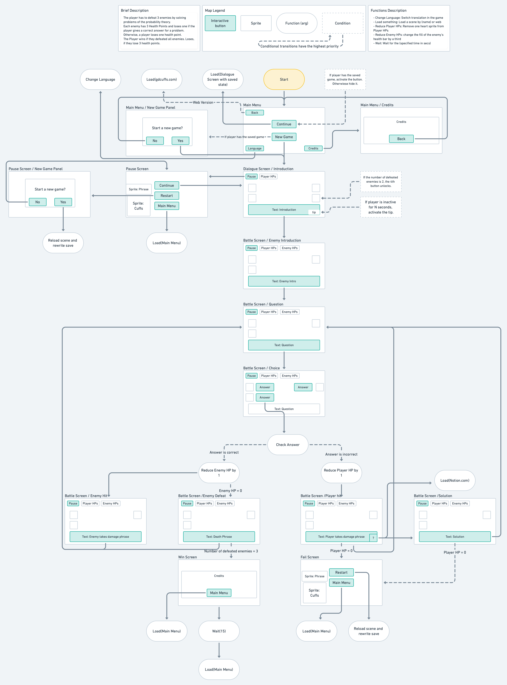

# What is it? 
Small game that was inspired by old dungeon crawlers and problems in probability theory. The main goal of the project is to give everyone an interactive problem book and textbook on the topic of probabilities.

## :joystick: Gameplay
Even a baby will understand the rules of the game, which cannot be said about the tasks in it.

You meet different monsters, each of which will ask you several questions and give several answers to them. You must choose one of them. If you gave the correct answer, then you inflict 1 damage on the monster, otherwise, you take 1 damage.

The game ends when you defeat 3 monsters, that is, you deal 3 damage to each of them, or when you take 3 damage.

## :video_game: Play
[Click to play](https://gdcuffs.com/dungeons-of-probability/)

## :round_pushpin: Requirements
* Unity 2019.4.28f1 or above with Android, iOS and WebGL modules installed
* .NET 4.5
* C# 7
* Latest JDK, SDK and NDK to build and run on Android
* Latest xCode to build and run on iOS

## :hammer: How to use it
Clone the project and install Unity. Run the project and open the loader scene to play.

## 🗺️ Screens Map

## :bulb: Possible Improvements
1. Adding new dungeons with different topics
2. Integration of the solutions directly into the game
3. Adding new languages (Chinese :cn:, German :de:, etc)
